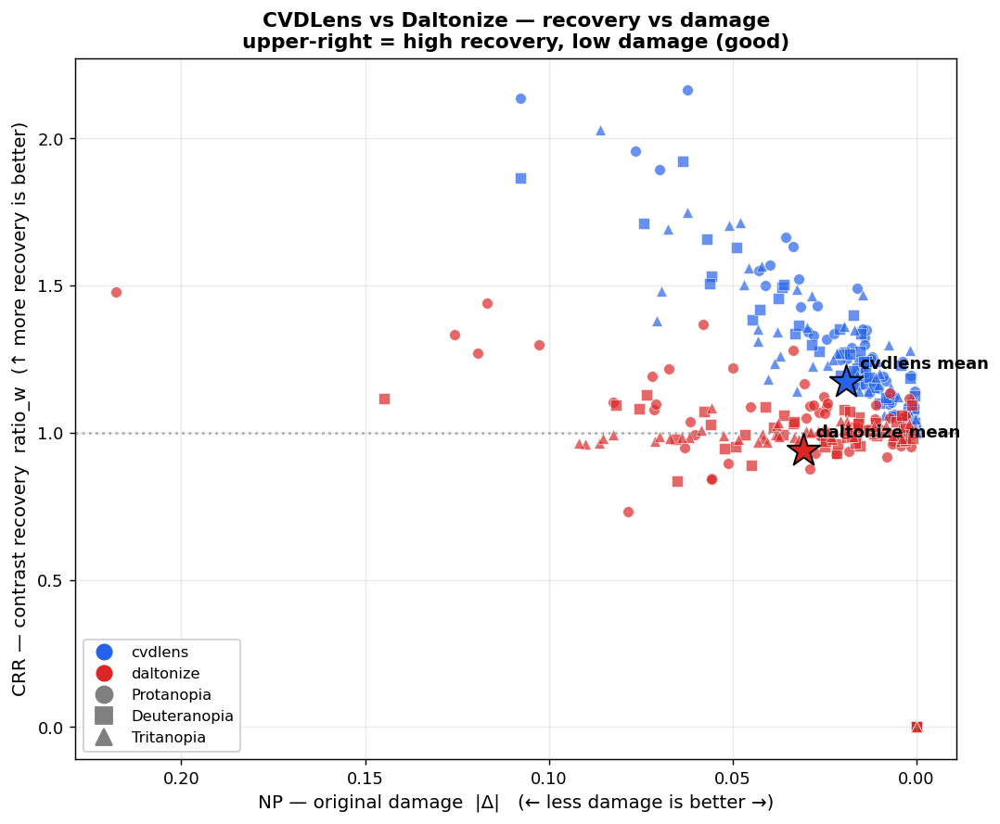
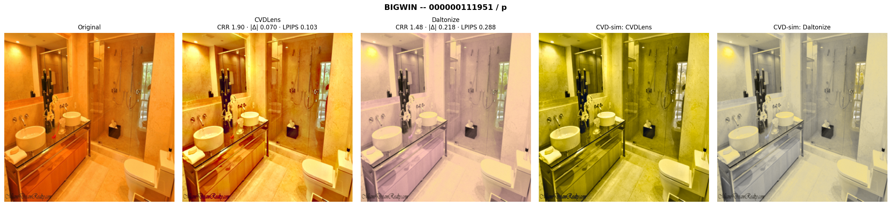
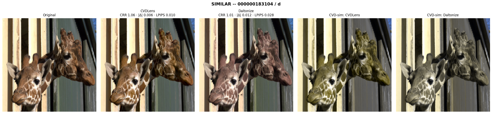
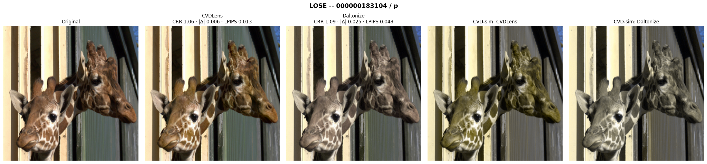

# Phase 2 Step 3 — CRR/NP Evaluation: CVDLens vs Daltonize

- Checkpoint: `model_best` (step 9000), severity 1.0
- Eval set: 60 images (top/mid/low 20×3), seed 20260803, pool 300
- Disjoint from Phase 1 bank (10) + held-out set (8)
- Fairness: both methods at 256², same simulator (machado, sev 1.0), same confusion weight w. Daltonize = `simulation.daltonize` (Brettel/error-shift; no external library).

## Metrics
- **CRR** (axis 1, ↑ better): `ratio_w` — confusion-weighted contrast ratio of sim(method) vs sim(original) on the CVD view (Phase 1 def).
- **NP** (axis 2, ↓ better): `|Δ|` mean sRGB change; `LPIPS` (VGG) perceptual distance to the original.
- Secondary: SI_uniform, corr_guide (Phase 1 logging set).

## Per-type summary (mean ± std)

| type | method | CRR ↑ | NP \|Δ\| ↓ | NP LPIPS ↓ | SI_uniform | corr_guide |
|---|---|---|---|---|---|---|
| p | cvdlens | 1.188 ± 0.444 | 0.0171 ± 0.0210 | 0.0423 ± 0.0498 | 0.371 | 0.465 |
| p | daltonize | 0.975 ± 0.328 | 0.0370 ± 0.0401 | 0.0738 ± 0.0646 | 0.211 | 0.351 |
| d | cvdlens | 1.159 ± 0.407 | 0.0193 ± 0.0218 | 0.0377 ± 0.0429 | 0.352 | 0.480 |
| d | daltonize | 0.924 ± 0.286 | 0.0241 ± 0.0270 | 0.0565 ± 0.0695 | 0.224 | 0.351 |
| t | cvdlens | 1.166 ± 0.414 | 0.0211 ± 0.0220 | 0.0573 ± 0.0629 | 0.284 | 0.530 |
| t | daltonize | 0.915 ± 0.279 | 0.0313 ± 0.0258 | 0.0688 ± 0.0451 | 0.214 | 0.474 |

## Per-tier summary (confusion-mass stratum)

CRR (`ratio_w`) is only meaningful where the confusion weight w has mass. In the **low** tier (w̄≈0) the weighted ratio divides two near-zero quantities and is unstable — read the low tier as a **naturalness / do-nothing test** (|Δ|, LPIPS should be ~0), not as recovery.

| tier | method | CRR | NP \|Δ\| | NP LPIPS |
|---|---|---|---|---|
| top | cvdlens | 1.477 | 0.0424 | 0.0994 |
| top | daltonize | 1.042 | 0.0653 | 0.1286 |
| mid | cvdlens | 1.230 | 0.0142 | 0.0349 |
| mid | daltonize | 1.016 | 0.0227 | 0.0529 |
| low | cvdlens | 0.807 | 0.0010 | 0.0031 |
| low | daltonize | 0.756 | 0.0043 | 0.0176 |

## Paired comparison (CVDLens − Daltonize, Wilcoxon signed-rank)

Positive CRR diff = CVDLens recovers more. Negative NP diff = CVDLens damages less (better).

| type | metric | CVDLens | Daltonize | diff (mean) | p |
|---|---|---|---|---|---|
| p | CRR | 1.188 | 0.975 | +0.213 | 1.53e-09 |
| p | NP_delta | 0.017 | 0.037 | -0.020 | 1.63e-11 |
| p | NP_lpips | 0.042 | 0.074 | -0.031 | 1.09e-09 |
| d | CRR | 1.159 | 0.924 | +0.235 | 2.14e-10 |
| d | NP_delta | 0.019 | 0.024 | -0.005 | 1.84e-04 |
| d | NP_lpips | 0.038 | 0.056 | -0.019 | 4.98e-04 |
| t | CRR | 1.166 | 0.915 | +0.251 | 1.38e-10 |
| t | NP_delta | 0.021 | 0.031 | -0.010 | 7.26e-07 |
| t | NP_lpips | 0.057 | 0.069 | -0.012 | 8.22e-03 |

## Verdict

- **CRR (top+mid, w-meaningful)**: CVDLens **1.353** vs Daltonize **1.029** → recovery ≥ (동등 이상). (Daltonize sits near 1.0 — little net weighted-contrast gain on the CVD view.)
- **NP (all tiers)**: |Δ| CVDLens **0.0192** vs **0.0308**; LPIPS **0.0458** vs **0.0664** → damage lower (better), significant on all types (p<0.05).
- **Low tier do-nothing (naturalness)**: |Δ| CVDLens **0.0010** vs Daltonize **0.0043** — CVDLens leaves low-confusion images nearly untouched; daltonize still perturbs them.

**HYPOTHESIS SUPPORTED**: on w-meaningful images CVDLens recovers contrast at least as well as daltonize (in fact more), while damaging naturalness less across all tiers (significant on every type).

> Caveat: low-tier `ratio_w` is numerically unstable (w̄≈0) and is excluded from the CRR verdict; it is used only as a naturalness check.

## Scatter

 — upper-right is good (high recovery, low damage).

## Case studies (5-panel witnesses)

### CVDLens wins big (≥ recovery, far less damage) — `000000111951` / Protanopia
CRR margin (CVDLens−Dalt) +0.417, |Δ| gap +0.1480, LPIPS gap +0.1852

### Closest match between methods — `000000183104` / Deuteranopia
CRR margin (CVDLens−Dalt) +0.042, |Δ| gap +0.0059, LPIPS gap +0.0181

### A case CVDLens loses on recovery — `000000183104` / Protanopia
CRR margin (CVDLens−Dalt) -0.026, |Δ| gap +0.0186, LPIPS gap +0.0346

